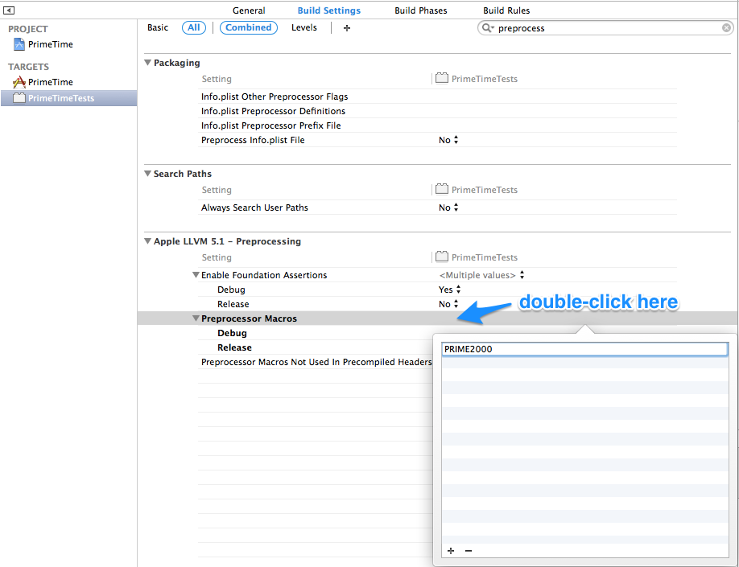

# Fibonacci Numbers
Solve for fibonacci numbers using loops, conditionals and arrays.

# Skills: arrays, methods, conditional logic
# Instructions: 
Create a method that returns the nth number of the fibonacci sequence; i.e. the 0th number in the sequence is returned when the input is 0 and the 5th number in the sequence is returned when the input is 5
  1. Open up the `.xcworkspace` file
  2. Check out the tests. Your goal is to create a [fibonacci number](http://www.mathsisfun.com/numbers/fibonacci-sequence.html) finder. Here are the rules of fibonacci numbers:
    - The fibonacci sequence = 0,1,1,2,3,5,8,13 etc 
    - For our purposes if n = 0 the element is 0 (the first number), if n = 1 the element is 1, n = 2 the element is 1.

##Advanced:
1. Create a new file inheriting from NSObject called `FISFiboFinderAdvanced`,
   with one method declared in your .h file:

    ```objc
    -(NSInteger)findFiboNumber:(NSInteger)number
    ```

2. To prepare for the next step, go to your test target, called FiboFinderTests, and find build settings. type 'preprocessor macros' into the search bar on the upper right, and double click the blank line next to 'Preprocessor Macros' and add 'ADVANCED'. Don't be confused by the attached image, instead of `PRIME2000`, that's where you'll be putting `ADVANCED`. 

3. Create a method (and a helper method if needed) to return the nth number of the fibonacci sequence using recursion instead of a loop.
